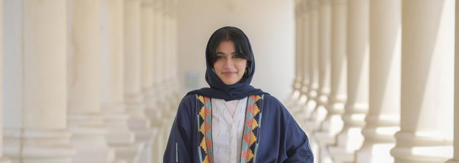

{:center: style="text-align: center"}
About Me
{:center}

### Hi! I'm an undergraduate at the American University of Sharjah double majoring in Physics and Electrical Engineering. I was born and raised in Dubai, UAE, and dedicate most of my time to research in astrophysics. In the fall, I'll be starting my PhD in astrophysics at Harvard University.

