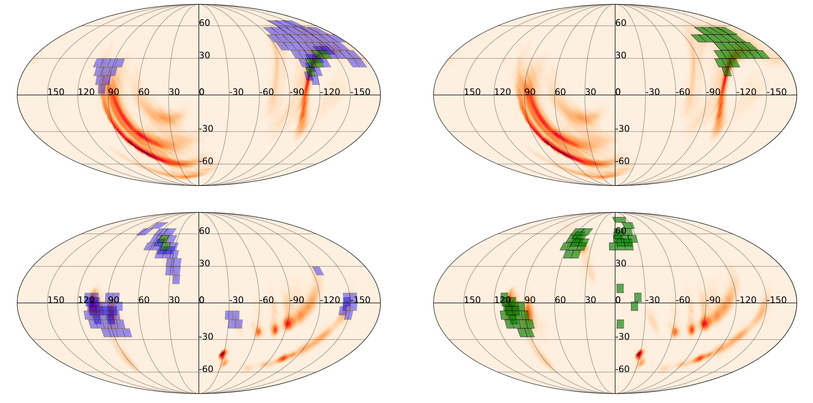

<!-- Main -->

<!-- One -->
<section id="one">
	

		<header class="major">
			<h1>My Research</h1>
		</header>

<!-- Content -->

 <h2 id="content">Multimessenger Astrophysics</h2> 
 

Much of my research during my undergraduate years, working mostly with Prof. Nidhal Guessoum, Prof. Michael Coughlin and within Prof. Mansi Kasliwal's group, revolved around investigating the merger of two neutron stars, or of one neutron star and one black hole. These events are expected to yield a variety of counterparts, including <em>Gravitational Waves</em> (GWs) and <em>kilonovae</em>. Kilonovae are optical/near-infrared counterparts powered primarily by radioactive decay. Thanks to the detection of GW170817/AT2017gfo, they have been found to be one of the dominant sources of heavy elements in the Universe; in other words, much of our gold and platinum jewelry was likely forged from the remnants of these cosmic explosions! 

  <h3> 1. Optimizing Observations of Kilonovae</h3> 
 

<dl>
	<dt>SUPER-SCHEDULING </dt>
	<dd>
		
Kilonovae are fast-fading transients, meaning we have to be at the top of our game when trying to detect them. One viable way is through GW follow-up. The global network of GW detectors (LIGO, Virgo, and KAGRA) detect a GW and release a localization of the source that can be very coarse -- up to thousands of square degrees. We have to try and cover this area with our telescopes as optimally as possible. One of my contributions to these efforts was an algorithm that allows past observations to be taken into account during integrated scheduling of telescope observations. This is useful for when some observations fail due to such circumstances as bad weather conditions. 

 

 

Fig. 1 - Superscheduling algorithm applied for two rounds using the GW190426 skymap. First round of observations, performed by the Zwicky Transient Facility, shown in black, successful observations subsequently shown in white. You can see that the second round of observations, performed with Pan-STARRS1, uses feedback from previous observations to cover the unobserved area.
	</dd>
	<dt>FILTER BALANCING</dt>
	<dd>
		
This algorithm, adaptable to large, multi-lobed GW localizations, was urgently needed by the Zwicky Transient Facility (ZTF), as <a href="https://github.com/mcoughlin/gwemopt"> GWEMOPT</a> was having issues re-scheduling visits in more than one filter, thus losing out on important color information for transient classification. The solution was two-fold: in the case of smaller localizations, I optimized the number of tiles to be scheduled; for larger maps that are very spread-out in Right Ascension (RA), I implemented the ability to slice up the sky-map in terms of RA and schedule each slice separately.

 

Fig 2. Skymap coverage with ZTF before and after the use of the appropriate filter balancing features. The top row shows scheduling of GW190425 without (on the left) and with (on the right) the filter balancing algo. The bottom row displays the same for S191213g. Fields represented in green have had all requested observations scheduled, while those in violet have not.
	</dd>
	<dt>SURVEY OPTIMIZATION</dt>
	<dd>
		
The second method of detecting kilonovae is to do so serendipitously. During regular survey operation, we try and optimize the cadence and exposure time so that we have a better chance of discovering a kilonova unprompted by a GW detection. By simulating year-long observing plans and evaluating their efficiencies, I quantified the benefits of red, very high-cadence observations. I also found that strategizing for a survey is very different from triggered/follow-up searches; this is because you can usually benefit from longer exposure times during follow-up due to the limited search area, but for surveys, exceeding past exposure times of 30 or 90 seconds was found to actually be detrimental. 

	</dd>
</dl>

 <h3>2. Kilonova Theory and Parameter Inference</h3> 
 

	

		<h4>TOY MODELS</h4>
		
It's useful to understand the parameter space of kilonovae and its relationship to the resultant lightcurves. Relatedly, the neutron star equation of state, which is a pressure-density relationship that is based upon the neutron star's nuclear microphysics, encodes macroscopic properties such as its radius and maximum non-rotating stable mass, and is important to consider. Starting out with a simplistic toy model (take a look at 'Kilonovae', Metzger 2019), I explored these dependencies and how they might affect observational prospects using heatmaps.

	

	

		<h4>SUPER-FAST GRID INTERPOLATION</h4>
		
When employing radiative transfer simulations, time is of the essence. They can take days to run, and so interpolation schemes are useful to more densely sample the parameter space and thus generate a robust kilonova grid for parameter inference. Yuhong Ning and I worked on using a neural net to perform the interpolation step, reducing the model loading time from ~ 80 min to hundreds of milliseconds.

	

	

		<h4>KILONOVA EJECTA GEOMETRIES</h4>
		
The structure and composition of the kilonova ejecta is a major topic of investigation. Although we only have one confirmed kilonova detection, we can still explore the structure of the two ejecta components -- dynamical and disk wind. The density profile of the disk wind is thought to be relatively spherically symmetric, while the density profile of the dynamical ejecta is thought to have an angular dependence based on numerical relativity sims. I explored this idea by fitting our kilonova grids to GW170817 and found that the best-fit does indeed have a moderate angular dependency.

	

